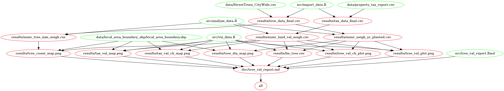

# Land Value and Public Trees

#### Created by: Teddy Haley

[Link to Personal repository](https://github.com/TedHaley)  
[Link to Milestone 3](https://github.com/TedHaley/tree_value/releases)  
[Link to Milestone 1 and 2](https://github.ubc.ca/teddyh/tree_value/releases)

## About
This project analyzes the correlation between land value in the City of Vancouver and public trees. 

## Usage
To run the project:

1. `git clone https://github.com/TedHaley/tree_value.git`
2. `cd Path-To-Local-Repo/tree_value`
3. `docker pull teddyhaley/tree_value`
4. `docker run --rm -it -v /Path-To-Local-Repo/tree_value:/home/tree_value teddyhaley/tree_value /bin/bash`
5. `cd home/tree_value/`
6. `make clean`
7. `make all`

## File Structure

 

## Data
The datasets used in this analysis are provided by the City of Vancouver Open data set. These datasets can be found at [Vanocuver Open Data](#http://data.vancouver.ca/datacatalogue/index.htm).

The datasets taken from the City of Vancouver website include:  
`property_tax_report.csv`  
`StreetTrees_CityWide.csv`  
`local_area_boundary_shp`

## Hypothesis
To test the correlation in size, age, and number of trees to the value of land in the City of Vancouver.

## Analysis
Using the property tax report for land values provided by the City of Vancouver, as well as the dataset for street trees in Vancouver, this analysis will test the correlation between land value and various attributes of street trees. These attributes include the size, age, number, and location of the trees. 

## Sub-Modules
There are 4 modules in the root directory. They include bin, data, doc, results, and src.

`data` contains all the raw data taken from the City of Vancouver website. This data includes spatial data for area boundaries, the public tree dataset, and the tax assessment dataset.

`doc` contains the compiled report with all generated graphics and analyses.

`results`: contains the cleaned data, all of the plots, and analysis performed.   

`src`: contains all of the scripts to perform the analysis. This folder contains the import, analysis, visualization, and running scripts. 

`packrat`: contains all of the required packages for the program to be run on another machine. 

