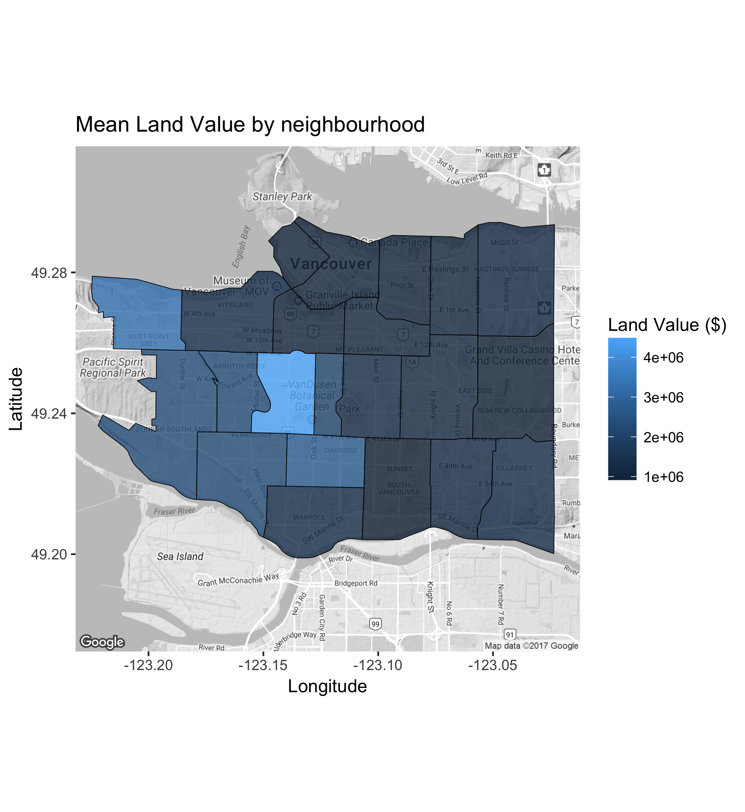
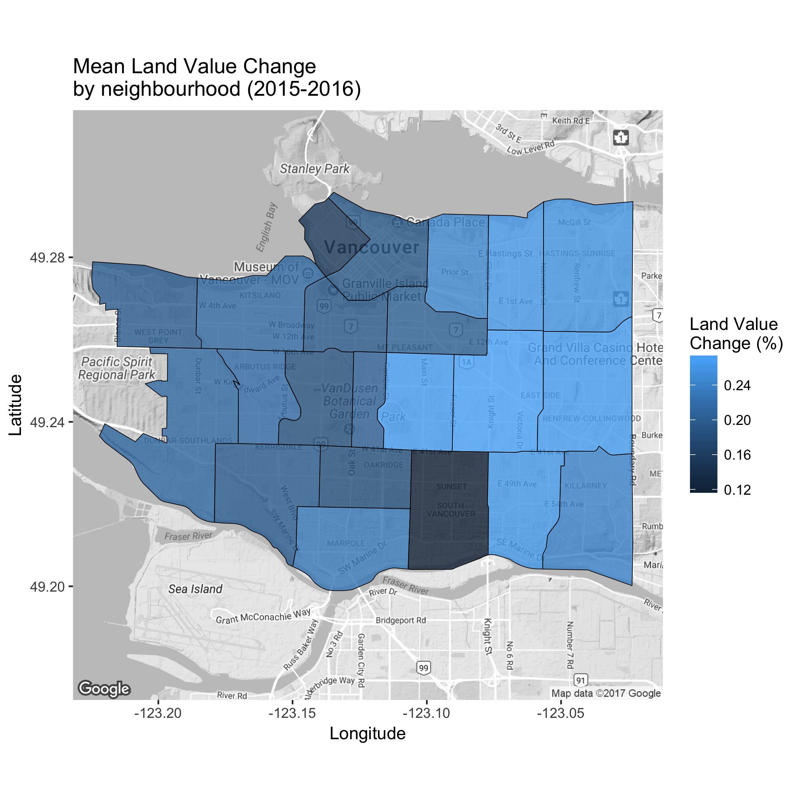
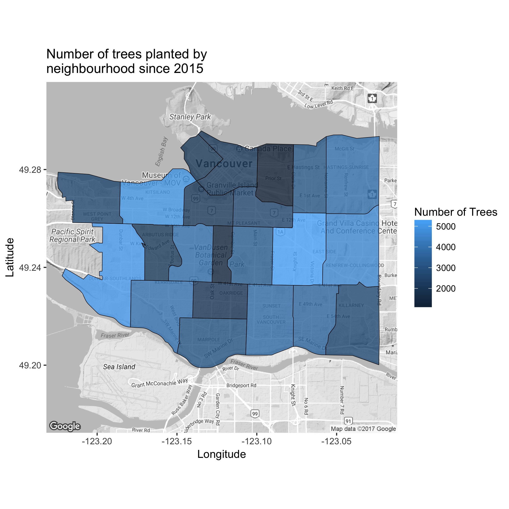
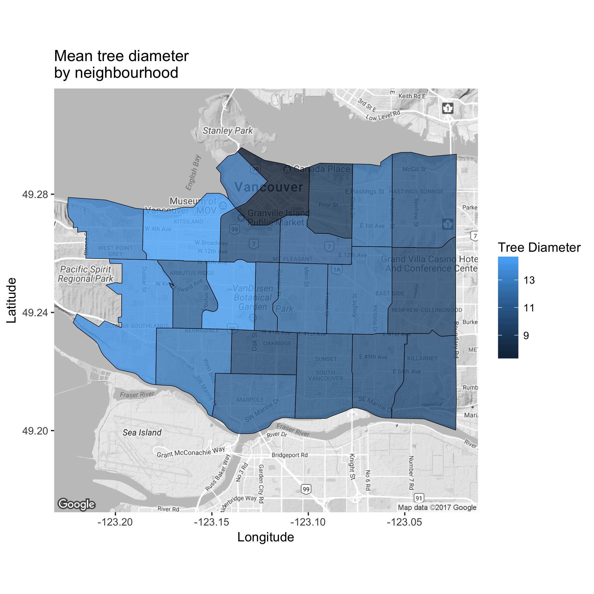
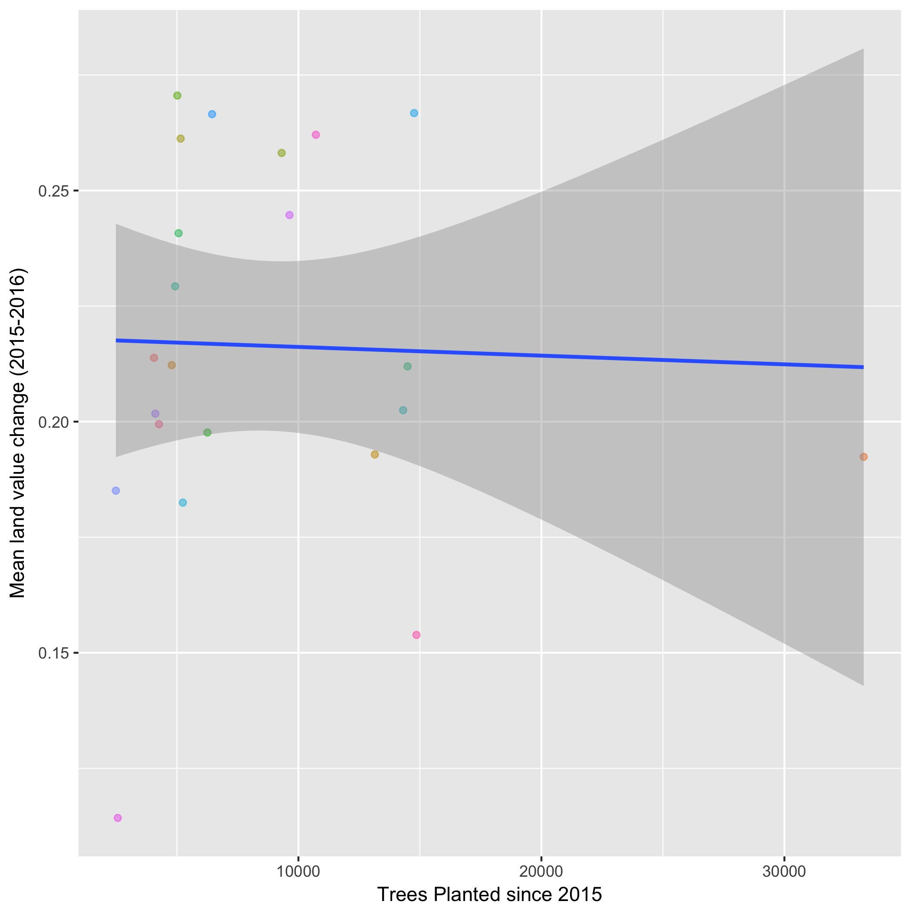
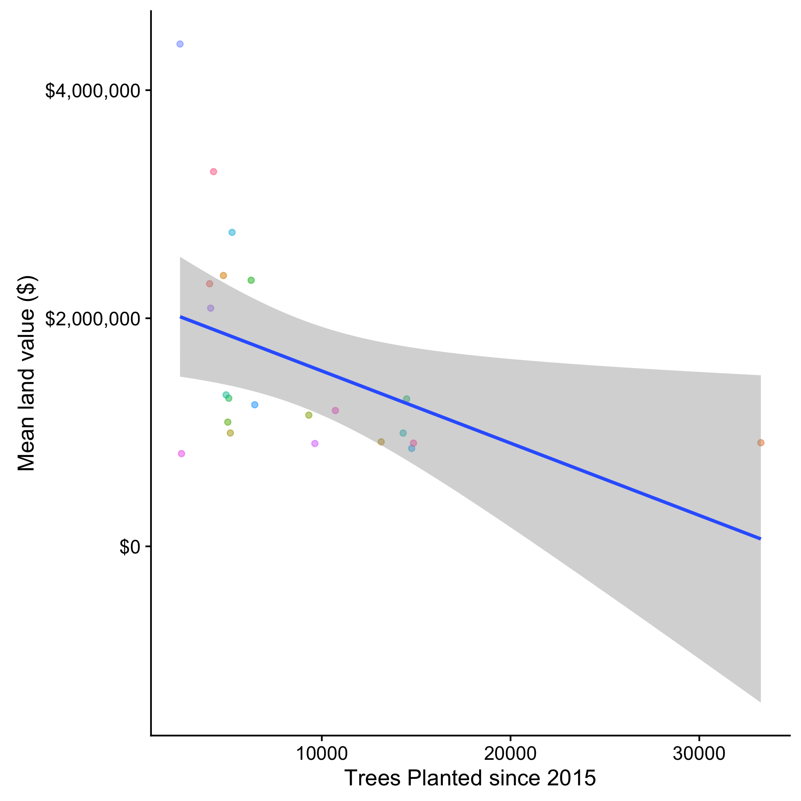

```{r}
library(ezknitr)
library(readr)
```

```{r setup, include=FALSE}
knitr::opts_chunk$set(echo = TRUE)
```

## Background


##Analysis
Using the property tax report for land values provided by the City of Vancouver, as well as the dataset for street trees in Vancouver, this analysis will test the correlation between land value and various attributes of street trees. These attributes include the size, age, number, and location of the trees. The data may also be used to generate the average number of trees by neighborhood in contrast with average land value. To help visualize the data, a heat map of Vancouver including the land value and location of trees are provided.

tax_val_map.png:


tax_val_ch_map:


tree_count_map:


tree_dia_map:


tree_val_ch_plot:



tree_val_plot:



