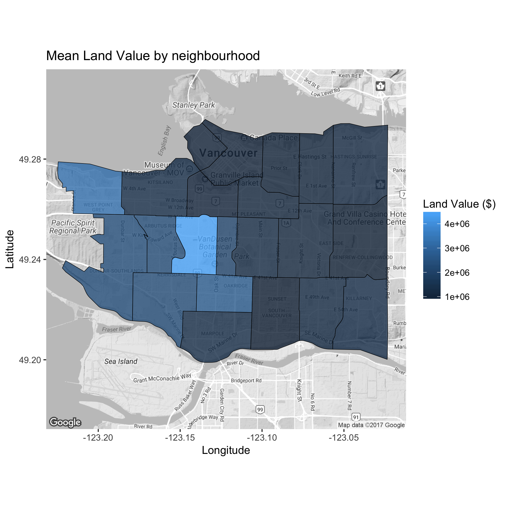

```{r}
library(ezknitr)
library(readr)
```

```{r setup, include=FALSE}
knitr::opts_chunk$set(echo = TRUE)
```

## The most frequent words in the 4 novels we studied:

tax_val_map.png:


tax_val_ch_map:


tree_count_map:


tree_dia_map:


tree_val_ch_plot:


tree_val_plot:


```{r}
read_csv("../results/lm_tree.csv")
```


