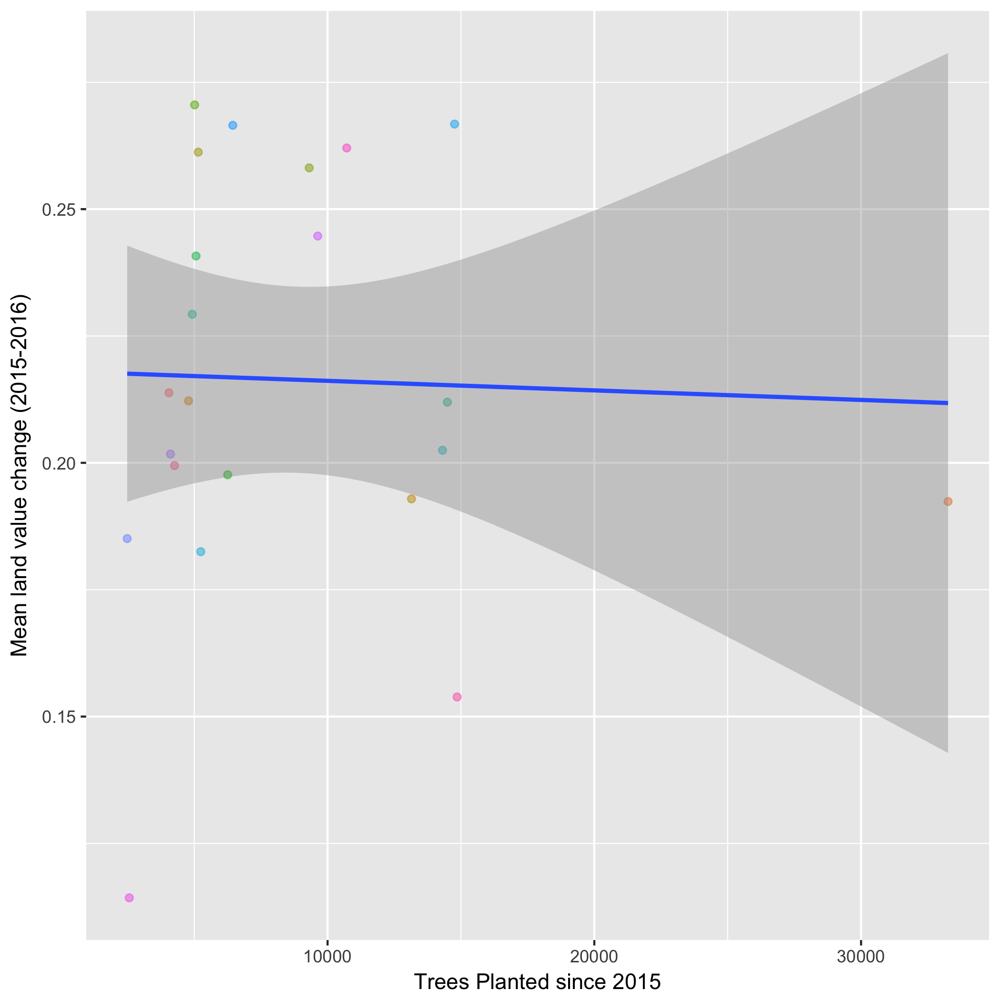
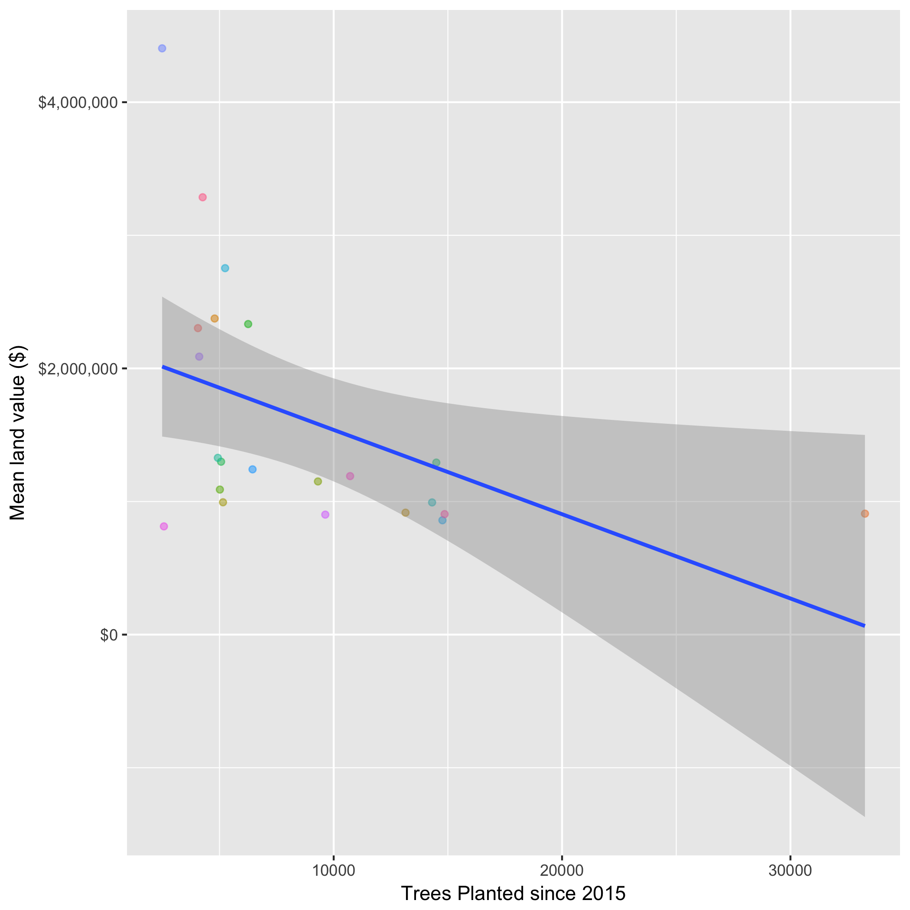

Land Value and Public Trees Analysis
================
Ted Haley
December, 2017

``` r
library(ezknitr)
```

The most frequent words in the 4 novels we studied:
---------------------------------------------------

tax\_val\_map.png: 

tax\_val\_ch\_map: 

tree\_count\_map: 

tree\_dia\_map: 

tree\_val\_ch\_plot: 

tree\_val\_plot: 
